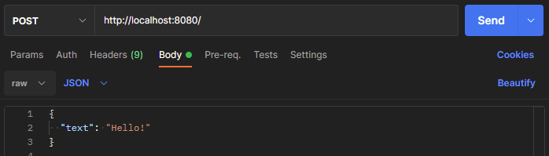
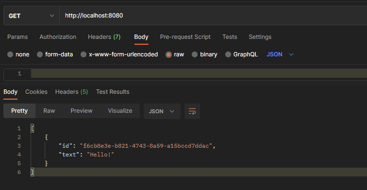

# SpringBootTutorial

This repository is a sample about how to use Spring Boot with Kotlin, and its purpose is to learn the basic concepts of the framework.

The tutorial used is available on [Kotlin documentation](https://kotlinlang.org/docs/jvm-get-started-spring-boot.html)

## How it works

The application is composed of a `post` method that stores an object of type message, and a `get` method that returns all saved messages.
 

